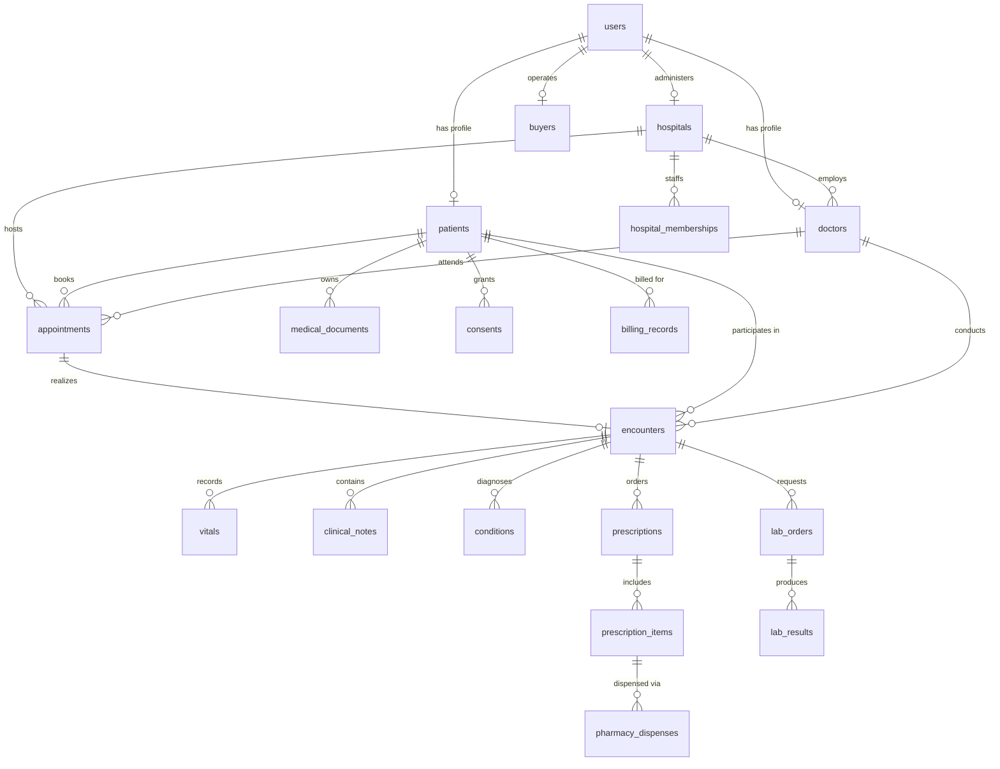

# MEDIID Target Architecture & PostgreSQL Design

## 1. Architectural Principles

The target MEDIID platform transitions from a tightly coupled Mongoose monolithic backend with embedded document structures to a **Modular Monolith in Node.js/Express backed by PostgreSQL**.

### Core Tenets:
1. **Clean Modular Architecture**: High cohesion, low coupling. Each domain module encapsulates its own routes, controllers, services, repositories, and validation schemas.
2. **Normalized Longitudinal Health Record**: Medical records are decomposed into dedicated relational entities connected through longitudinal clinical encounters.
3. **Decoupled Future AI Services**: AI and heavy vision tasks (OCR, RAG, clinical summaries) are bounded by an external API contract ready for a standalone Python FastAPI microservice, leaving Express lightweight and focused on core transactions.
4. **Context-Aware Security**: Authorization transcends static roles to evaluate `Role + Organization + Resource Ownership + Patient Consent + Purpose of Use + Time Bound + Break-Glass`.

---

## 2. Target Directory Structure

```
backend/
├── src/
│   ├── app.js                          # Express app configuration & middleware pipeline
│   ├── server.js                       # HTTP server bootstrapping, Socket.IO & graceful shutdown
│   │
│   ├── config/                         # Environment variables, database configs, logger setup
│   │   ├── env.js
│   │   ├── database.js                 # PostgreSQL connection pool & ORM client instance
│   │   └── constants.js
│   │
│   ├── database/                       # Migrations, seeders, and relational schemas
│   │   ├── schema/                     # Drizzle schema definitions or Prisma schema
│   │   │   ├── auth.js
│   │   │   ├── patients.js
│   │   │   ├── clinical.js
│   │   │   ├── hospitals.js
│   │   │   ├── appointments.js
│   │   │   ├── billing.js
│   │   │   └── marketplace.js
│   │   ├── migrations/                 # Version-controlled SQL migration scripts
│   │   └── seeds/                      # Deterministic relational seed scripts
│   │
│   ├── middleware/                     # Cross-cutting HTTP middleware
│   │   ├── authenticate.js             # JWT extraction and user session hydration
│   │   ├── authorize.js                # Granular RBAC and permission checking
│   │   ├── contextAccessGuard.js       # Dynamic consent, appointment window, and break-glass validator
│   │   ├── validateRequest.js          # Zod schema validation middleware
│   │   ├── errorHandler.js             # Centralized error handler and operational exception mapper
│   │   └── requestAuditLogger.js       # Structured HTTP access audit trail
│   │
│   ├── modules/                        # Domain feature modules (Modular Monolith)
│   │   ├── auth/                       # Register, login, doctor activation, password reset
│   │   │   ├── auth.routes.js
│   │   │   ├── auth.controller.js
│   │   │   ├── auth.service.js
│   │   │   ├── auth.repository.js
│   │   │   └── auth.validation.js
│   │   ├── users/                      # User identity management and status toggling
│   │   ├── patients/                   # Demographics, emergency data, benefits, and trusted providers
│   │   ├── doctors/                    # Practitioner credentials, slots, and availability
│   │   ├── hospitals/                  # Facilities, departments, wards, and administrative metrics
│   │   ├── appointments/               # Consultation scheduling, status transitions, SMS tokens
│   │   ├── encounters/                 # Longitudinal clinical visits and episodes of care
│   │   ├── ehr/                        # Vitals, clinical notes, diagnoses, allergies, and history
│   │   ├── prescriptions/              # Medication orders, items, dosages, instructions, and dispenses
│   │   ├── diagnostics/                # Lab test orders, specimens, results, and imaging studies
│   │   ├── documents/                  # Medical document references, metadata, S3/local storage
│   │   ├── pharmacy/                   # Hospital dispensing queues, stock verification, and counters
│   │   ├── billing/                    # Unified invoicing, fee schedules, payments, and insurance claims
│   │   ├── messaging/                  # Real-time WebSocket and asynchronous chat messaging
│   │   ├── notifications/              # SMS, WhatsApp, and email dispatch queues
│   │   ├── consent/                    # Patient access grants, consents, and break-glass overrides
│   │   ├── audit/                      # Immutable clinical and administrative access logs
│   │   └── marketplace/                # Buyer requirements, anonymized dataset submissions, payouts
│   │
│   ├── shared/                         # Shared value objects, domain events, and base classes
│   │   ├── errors/
│   │   ├── events/
│   │   └── types/
│   │
│   └── utils/                          # Pure helpers
│       ├── idGenerator.js              # MID, HID, and hierarchical ID formatters
│       ├── qrCode.js                   # QR generation and payload signing
│       └── crypto.js
│
├── tests/
│   ├── unit/
│   └── integration/
│
└── package.json
```

---

## 3. Target PostgreSQL Relational Data Model

### Entity-Relationship Diagram (Longitudinal Clinical Care)



---

## 4. Entity Definitions & DDL Specification

### Core Identity & Access
```sql
CREATE EXTENSION IF NOT EXISTS "uuid-ossp";

CREATE TABLE users (
    id UUID PRIMARY KEY DEFAULT gen_random_uuid(),
    email VARCHAR(255) UNIQUE,
    uid VARCHAR(64) UNIQUE,
    password_hash VARCHAR(255) NOT NULL,
    role VARCHAR(32) NOT NULL CHECK (role IN ('patient', 'hospital_admin', 'doctor', 'buyer', 'pharmacy')),
    is_active BOOLEAN NOT NULL DEFAULT TRUE,
    reset_password_token VARCHAR(32),
    reset_password_expires_at TIMESTAMPTZ,
    last_login_at TIMESTAMPTZ,
    created_at TIMESTAMPTZ NOT NULL DEFAULT NOW(),
    updated_at TIMESTAMPTZ NOT NULL DEFAULT NOW()
);

CREATE INDEX idx_users_email ON users(email);
CREATE INDEX idx_users_uid ON users(uid);
```

### Organizations & Healthcare Personnel
```sql
CREATE TABLE hospitals (
    id UUID PRIMARY KEY DEFAULT gen_random_uuid(),
    user_id UUID NOT NULL REFERENCES users(id) ON DELETE CASCADE,
    uid VARCHAR(32) NOT NULL UNIQUE, -- e.g., HID-XXXXXXXX
    name VARCHAR(255) NOT NULL,
    registration_number VARCHAR(128),
    type VARCHAR(32) NOT NULL DEFAULT 'private' CHECK (type IN ('government', 'private', 'trust', 'clinic')),
    street VARCHAR(255),
    city VARCHAR(100),
    state VARCHAR(100),
    pincode VARCHAR(20),
    country VARCHAR(100) DEFAULT 'India',
    latitude NUMERIC(9, 6),
    longitude NUMERIC(9, 6),
    contact_phone VARCHAR(32),
    contact_email VARCHAR(255),
    website VARCHAR(255),
    emergency_phone VARCHAR(32),
    specialties TEXT[],
    facilities TEXT[],
    operating_hours JSONB,
    total_beds INT DEFAULT 0,
    icu_beds INT DEFAULT 0,
    logo_url TEXT,
    photos TEXT[],
    rating_average NUMERIC(3, 2) DEFAULT 0.00,
    rating_count INT DEFAULT 0,
    doctor_sequence INT NOT NULL DEFAULT 0,
    staff_sequence INT NOT NULL DEFAULT 0,
    is_verified BOOLEAN NOT NULL DEFAULT FALSE,
    is_active BOOLEAN NOT NULL DEFAULT TRUE,
    created_at TIMESTAMPTZ NOT NULL DEFAULT NOW(),
    updated_at TIMESTAMPTZ NOT NULL DEFAULT NOW()
);

CREATE INDEX idx_hospitals_city ON hospitals(city);
CREATE INDEX idx_hospitals_active ON hospitals(is_active);

CREATE TABLE doctors (
    id UUID PRIMARY KEY DEFAULT gen_random_uuid(),
    user_id UUID REFERENCES users(id) ON DELETE SET NULL,
    hospital_id UUID NOT NULL REFERENCES hospitals(id) ON DELETE RESTRICT,
    uid VARCHAR(64) NOT NULL UNIQUE, -- e.g., HID-XXXX-DOC-0001
    first_name VARCHAR(100) NOT NULL,
    last_name VARCHAR(100) NOT NULL,
    specialization VARCHAR(150) NOT NULL,
    sub_specialties TEXT[],
    qualifications TEXT[],
    experience_years INT,
    registration_number VARCHAR(100),
    phone VARCHAR(32),
    email VARCHAR(255),
    photo_url TEXT,
    consultation_fee NUMERIC(10, 2) DEFAULT 500.00,
    expertise TEXT[],
    languages TEXT[],
    rating_average NUMERIC(3, 2) DEFAULT 0.00,
    rating_count INT DEFAULT 0,
    status VARCHAR(32) NOT NULL DEFAULT 'available' CHECK (status IN ('available', 'busy', 'on_leave', 'offline')),
    is_active BOOLEAN NOT NULL DEFAULT TRUE,
    created_at TIMESTAMPTZ NOT NULL DEFAULT NOW(),
    updated_at TIMESTAMPTZ NOT NULL DEFAULT NOW()
);

CREATE INDEX idx_doctors_hospital ON doctors(hospital_id);
CREATE INDEX idx_doctors_specialization ON doctors(specialization);

CREATE TABLE doctor_slots (
    id UUID PRIMARY KEY DEFAULT gen_random_uuid(),
    doctor_id UUID NOT NULL REFERENCES doctors(id) ON DELETE CASCADE,
    hospital_id UUID NOT NULL REFERENCES hospitals(id) ON DELETE CASCADE,
    schedule_type VARCHAR(16) NOT NULL CHECK (schedule_type IN ('date', 'day')),
    specific_date DATE,
    day_of_week VARCHAR(16) CHECK (day_of_week IN ('Monday','Tuesday','Wednesday','Thursday','Friday','Saturday','Sunday')),
    time_slots TEXT[] NOT NULL,
    max_bookings INT NOT NULL DEFAULT 1,
    is_active BOOLEAN NOT NULL DEFAULT TRUE,
    created_at TIMESTAMPTZ NOT NULL DEFAULT NOW(),
    updated_at TIMESTAMPTZ NOT NULL DEFAULT NOW()
);

CREATE INDEX idx_doctor_slots_schedule ON doctor_slots(doctor_id, schedule_type, specific_date, day_of_week);

CREATE TABLE hospital_memberships (
    id UUID PRIMARY KEY DEFAULT gen_random_uuid(),
    hospital_id UUID NOT NULL REFERENCES hospitals(id) ON DELETE CASCADE,
    uid VARCHAR(64) NOT NULL UNIQUE,
    first_name VARCHAR(100) NOT NULL,
    last_name VARCHAR(100) NOT NULL,
    role VARCHAR(32) NOT NULL CHECK (role IN ('nurse', 'receptionist', 'lab_technician', 'pharmacist', 'ward_boy', 'security', 'administrator', 'radiologist', 'physiotherapist', 'other')),
    department VARCHAR(100),
    employee_id VARCHAR(64),
    phone VARCHAR(32),
    email VARCHAR(255),
    shift VARCHAR(20) DEFAULT 'morning',
    status VARCHAR(20) DEFAULT 'active',
    is_active BOOLEAN NOT NULL DEFAULT TRUE,
    created_at TIMESTAMPTZ NOT NULL DEFAULT NOW()
);

CREATE TABLE pharmacies (
    id UUID PRIMARY KEY DEFAULT gen_random_uuid(),
    user_id UUID NOT NULL REFERENCES users(id) ON DELETE CASCADE,
    hospital_id UUID NOT NULL REFERENCES hospitals(id) ON DELETE CASCADE,
    name VARCHAR(255) NOT NULL DEFAULT 'Hospital Pharmacy',
    phone VARCHAR(32),
    email VARCHAR(255),
    created_at TIMESTAMPTZ NOT NULL DEFAULT NOW()
);
```

### Patient Profile & Longitudinal EHR Entities
```sql
CREATE TABLE patients (
    id UUID PRIMARY KEY DEFAULT gen_random_uuid(),
    user_id UUID NOT NULL UNIQUE REFERENCES users(id) ON DELETE CASCADE,
    uid VARCHAR(32) NOT NULL UNIQUE, -- e.g., MID-XXXXXXXX
    first_name VARCHAR(100) NOT NULL,
    last_name VARCHAR(100) NOT NULL,
    date_of_birth DATE,
    gender VARCHAR(16) CHECK (gender IN ('male', 'female', 'other')),
    phone VARCHAR(32),
    profile_photo_url TEXT,
    street VARCHAR(255),
    city VARCHAR(100),
    state VARCHAR(100),
    pincode VARCHAR(20),
    country VARCHAR(100) DEFAULT 'India',
    blood_group VARCHAR(8) CHECK (blood_group IN ('A+', 'A-', 'B+', 'B-', 'AB+', 'AB-', 'O+', 'O-')),
    aadhaar_hash VARCHAR(128),
    organ_donor BOOLEAN DEFAULT FALSE,
    emergency_contact_name VARCHAR(100),
    emergency_contact_phone VARCHAR(32),
    emergency_contact_relation VARCHAR(50),
    qr_active BOOLEAN NOT NULL DEFAULT TRUE,
    created_at TIMESTAMPTZ NOT NULL DEFAULT NOW(),
    updated_at TIMESTAMPTZ NOT NULL DEFAULT NOW()
);

CREATE INDEX idx_patients_uid ON patients(uid);
CREATE INDEX idx_patients_phone ON patients(phone);

CREATE TABLE patient_benefits (
    id UUID PRIMARY KEY DEFAULT gen_random_uuid(),
    patient_id UUID NOT NULL REFERENCES patients(id) ON DELETE CASCADE,
    source VARCHAR(32) NOT NULL CHECK (source IN ('government', 'employer', 'personal')),
    type VARCHAR(64) NOT NULL DEFAULT 'other_govt',
    scheme_name VARCHAR(255),
    card_number VARCHAR(128),
    policy_number VARCHAR(128),
    beneficiary_name VARCHAR(255),
    employer_name VARCHAR(255),
    employee_id VARCHAR(64),
    designation VARCHAR(100),
    insurer_name VARCHAR(255),
    tpa_name VARCHAR(255),
    tpa_phone VARCHAR(32),
    coverage_amount NUMERIC(12, 2),
    room_rent_limit NUMERIC(10, 2),
    family_covered BOOLEAN DEFAULT FALSE,
    family_members TEXT[],
    valid_from DATE,
    valid_until DATE,
    hospital_network TEXT,
    claim_process TEXT,
    helpline_number VARCHAR(32),
    notes TEXT,
    is_active BOOLEAN NOT NULL DEFAULT TRUE,
    created_at TIMESTAMPTZ NOT NULL DEFAULT NOW()
);

CREATE TABLE appointments (
    id UUID PRIMARY KEY DEFAULT gen_random_uuid(),
    patient_id UUID NOT NULL REFERENCES patients(id) ON DELETE RESTRICT,
    doctor_id UUID NOT NULL REFERENCES doctors(id) ON DELETE RESTRICT,
    hospital_id UUID NOT NULL REFERENCES hospitals(id) ON DELETE RESTRICT,
    appointment_date DATE NOT NULL,
    time_slot VARCHAR(32) NOT NULL,
    status VARCHAR(32) NOT NULL DEFAULT 'pending' CHECK (status IN ('pending', 'reminder_sent', 'confirmed', 'checked_in', 'completed', 'expired', 'cancelled', 'rescheduled')),
    type VARCHAR(32) NOT NULL DEFAULT 'consultation' CHECK (type IN ('consultation', 'follow_up', 'emergency', 'procedure', 'video', 'teleconsultation')),
    booking_method VARCHAR(32) DEFAULT 'app',
    preferred_contact_method VARCHAR(32) DEFAULT 'whatsapp',
    contact_phone VARCHAR(32),
    symptoms TEXT,
    notes TEXT,
    confirm_token UUID NOT NULL DEFAULT gen_random_uuid(),
    confirm_token_used BOOLEAN NOT NULL DEFAULT FALSE,
    patient_confirmed_at TIMESTAMPTZ,
    handled_by_user_id UUID REFERENCES users(id),
    staff_notes TEXT,
    confirmed_at TIMESTAMPTZ,
    confirmation_method VARCHAR(32),
    bill_amount NUMERIC(10, 2) DEFAULT 500.00,
    bill_status VARCHAR(32) DEFAULT 'pending' CHECK (bill_status IN ('pending', 'paid', 'insurance_claimed')),
    created_at TIMESTAMPTZ NOT NULL DEFAULT NOW(),
    updated_at TIMESTAMPTZ NOT NULL DEFAULT NOW()
);

CREATE INDEX idx_appointments_patient ON appointments(patient_id);
CREATE INDEX idx_appointments_doctor_date ON appointments(doctor_id, appointment_date);

CREATE TABLE encounters (
    id UUID PRIMARY KEY DEFAULT gen_random_uuid(),
    appointment_id UUID REFERENCES appointments(id) ON DELETE SET NULL,
    patient_id UUID NOT NULL REFERENCES patients(id) ON DELETE RESTRICT,
    doctor_id UUID NOT NULL REFERENCES doctors(id) ON DELETE RESTRICT,
    hospital_id UUID NOT NULL REFERENCES hospitals(id) ON DELETE RESTRICT,
    encounter_type VARCHAR(32) NOT NULL DEFAULT 'ambulatory' CHECK (encounter_type IN ('ambulatory', 'emergency', 'inpatient', 'virtual')),
    status VARCHAR(32) NOT NULL DEFAULT 'in_progress' CHECK (status IN ('planned', 'in_progress', 'completed', 'cancelled')),
    start_time TIMESTAMPTZ NOT NULL DEFAULT NOW(),
    end_time TIMESTAMPTZ,
    chief_complaint TEXT,
    created_at TIMESTAMPTZ NOT NULL DEFAULT NOW()
);

CREATE INDEX idx_encounters_patient ON encounters(patient_id);

CREATE TABLE vitals (
    id UUID PRIMARY KEY DEFAULT gen_random_uuid(),
    encounter_id UUID NOT NULL REFERENCES encounters(id) ON DELETE CASCADE,
    recorded_at TIMESTAMPTZ NOT NULL DEFAULT NOW(),
    systolic_bp INT,
    diastolic_bp INT,
    heart_rate INT,
    respiratory_rate INT,
    temperature_celsius NUMERIC(4, 2),
    spo2_percentage INT,
    weight_kg NUMERIC(5, 2),
    height_cm NUMERIC(5, 2),
    bmi NUMERIC(4, 2)
);

CREATE TABLE clinical_notes (
    id UUID PRIMARY KEY DEFAULT gen_random_uuid(),
    encounter_id UUID NOT NULL REFERENCES encounters(id) ON DELETE CASCADE,
    author_id UUID NOT NULL REFERENCES users(id),
    note_type VARCHAR(32) NOT NULL DEFAULT 'progress' CHECK (note_type IN ('progress', 'consultation', 'discharge', 'procedure')),
    subjective TEXT,
    objective TEXT,
    assessment TEXT,
    plan TEXT,
    created_at TIMESTAMPTZ NOT NULL DEFAULT NOW()
);

CREATE TABLE conditions (
    id UUID PRIMARY KEY DEFAULT gen_random_uuid(),
    patient_id UUID NOT NULL REFERENCES patients(id) ON DELETE CASCADE,
    encounter_id UUID REFERENCES encounters(id) ON DELETE SET NULL,
    icd10_code VARCHAR(16),
    display_name VARCHAR(255) NOT NULL,
    clinical_status VARCHAR(32) DEFAULT 'active' CHECK (clinical_status IN ('active', 'recurrence', 'relapse', 'remission', 'resolved')),
    verification_status VARCHAR(32) DEFAULT 'confirmed',
    diagnosed_date DATE,
    resolved_date DATE,
    created_at TIMESTAMPTZ NOT NULL DEFAULT NOW()
);

CREATE TABLE allergies (
    id UUID PRIMARY KEY DEFAULT gen_random_uuid(),
    patient_id UUID NOT NULL REFERENCES patients(id) ON DELETE CASCADE,
    substance VARCHAR(255) NOT NULL,
    reaction TEXT,
    severity VARCHAR(32) CHECK (severity IN ('mild', 'moderate', 'severe', 'fatal')),
    created_at TIMESTAMPTZ NOT NULL DEFAULT NOW()
);

CREATE TABLE prescriptions (
    id UUID PRIMARY KEY DEFAULT gen_random_uuid(),
    encounter_id UUID REFERENCES encounters(id) ON DELETE SET NULL,
    patient_id UUID NOT NULL REFERENCES patients(id) ON DELETE RESTRICT,
    doctor_id UUID NOT NULL REFERENCES doctors(id) ON DELETE RESTRICT,
    hospital_id UUID NOT NULL REFERENCES hospitals(id) ON DELETE RESTRICT,
    notes TEXT,
    status VARCHAR(32) NOT NULL DEFAULT 'active' CHECK (status IN ('active', 'dispensed', 'cancelled', 'completed')),
    issued_at TIMESTAMPTZ NOT NULL DEFAULT NOW()
);

CREATE TABLE prescription_items (
    id UUID PRIMARY KEY DEFAULT gen_random_uuid(),
    prescription_id UUID NOT NULL REFERENCES prescriptions(id) ON DELETE CASCADE,
    medication_name VARCHAR(255) NOT NULL,
    dosage VARCHAR(100) NOT NULL, -- e.g. "650mg"
    form VARCHAR(50),             -- e.g. "tablet", "syrup"
    frequency VARCHAR(100),        -- e.g. "1-0-1 after food"
    duration VARCHAR(50),         -- e.g. "5 days"
    quantity INT NOT NULL DEFAULT 1,
    instructions TEXT
);

CREATE TABLE medical_documents (
    id UUID PRIMARY KEY DEFAULT gen_random_uuid(),
    patient_id UUID NOT NULL REFERENCES patients(id) ON DELETE CASCADE,
    encounter_id UUID REFERENCES encounters(id) ON DELETE SET NULL,
    uploaded_by_user_id UUID NOT NULL REFERENCES users(id),
    hospital_name VARCHAR(255),
    doctor_name VARCHAR(255),
    type VARCHAR(32) NOT NULL CHECK (type IN ('prescription', 'scan', 'bill', 'lab_report', 'discharge_summary', 'other')),
    title VARCHAR(255) NOT NULL,
    file_url TEXT NOT NULL,
    file_name VARCHAR(255),
    file_size_bytes INT,
    mime_type VARCHAR(100),
    notes TEXT,
    uploaded_at TIMESTAMPTZ NOT NULL DEFAULT NOW()
);
```

### Marketplace & Research Data Access
```sql
CREATE TABLE buyers (
    id UUID PRIMARY KEY DEFAULT gen_random_uuid(),
    user_id UUID NOT NULL UNIQUE REFERENCES users(id) ON DELETE CASCADE,
    company_name VARCHAR(255) NOT NULL,
    description TEXT,
    website VARCHAR(255),
    phone VARCHAR(32),
    address TEXT,
    created_at TIMESTAMPTZ NOT NULL DEFAULT NOW()
);

CREATE TABLE research_requirements (
    id UUID PRIMARY KEY DEFAULT gen_random_uuid(),
    buyer_id UUID NOT NULL REFERENCES buyers(id) ON DELETE CASCADE,
    title VARCHAR(255) NOT NULL,
    target_sample_size VARCHAR(100) NOT NULL,
    data_needed TEXT NOT NULL,
    description TEXT NOT NULL,
    pricing JSONB NOT NULL DEFAULT '{"prescriptions":0,"scans":0,"xrays":0,"labReports":0}',
    required_docs TEXT[] NOT NULL,
    status VARCHAR(32) NOT NULL DEFAULT 'active' CHECK (status IN ('active', 'closed', 'completed')),
    created_at TIMESTAMPTZ NOT NULL DEFAULT NOW()
);

CREATE TABLE dataset_submissions (
    id UUID PRIMARY KEY DEFAULT gen_random_uuid(),
    requirement_id UUID NOT NULL REFERENCES research_requirements(id) ON DELETE CASCADE,
    patient_id UUID NOT NULL REFERENCES patients(id) ON DELETE RESTRICT,
    status VARCHAR(32) NOT NULL DEFAULT 'pending' CHECK (status IN ('pending', 'accepted', 'rejected', 'paid')),
    payout_amount NUMERIC(10, 2) DEFAULT 0.00,
    created_at TIMESTAMPTZ NOT NULL DEFAULT NOW()
);

CREATE TABLE submission_documents (
    id UUID PRIMARY KEY DEFAULT gen_random_uuid(),
    submission_id UUID NOT NULL REFERENCES dataset_submissions(id) ON DELETE CASCADE,
    type VARCHAR(32) NOT NULL,
    file_url TEXT NOT NULL,
    file_name VARCHAR(255),
    uploaded_at TIMESTAMPTZ NOT NULL DEFAULT NOW()
);

CREATE TABLE marketplace_messages (
    id UUID PRIMARY KEY DEFAULT gen_random_uuid(),
    requirement_id UUID REFERENCES research_requirements(id) ON DELETE SET NULL,
    sender_id UUID NOT NULL REFERENCES users(id) ON DELETE CASCADE,
    receiver_id UUID NOT NULL REFERENCES users(id) ON DELETE CASCADE,
    content TEXT NOT NULL,
    is_read BOOLEAN NOT NULL DEFAULT FALSE,
    created_at TIMESTAMPTZ NOT NULL DEFAULT NOW()
);
```

---

## 5. Security & Context-Aware Authorization Engine

### Access Decision Evaluation Tree
For any operation requesting patient data, the authorization engine evaluates:

$$\text{Decision} = \text{Role} \wedge \text{Org Boundary} \wedge (\text{Ownership} \vee \text{Active Appointment Session} \vee \text{Explicit Consent} \vee \text{Break-Glass})$$

```
Request to /api/patients/:uid or /api/ehr/encounters
  │
  ├─ 1. Authenticate Token (Valid JWT, User is active)
  │
  ├─ 2. Is User the Patient? 
  │      └─ YES ──> ALLOW (Owner)
  │
  ├─ 3. Is User a Doctor?
  │      ├─ Check if Patient has active ConsultationSession with Doctor
  │      │     └─ YES (Valid time window: Appointment Start - 10min to +2h) ──> ALLOW
  │      ├─ Check if Patient has granted Consent for Doctor / Hospital
  │      │     └─ YES (Within valid date range and approved scopes) ──> ALLOW
  │      ├─ Is Emergency Break-Glass Flag set?
  │      │     └─ YES ──> Verify Emergency Reason + Mandatory High-Priority Audit Log ──> ALLOW
  │      └─ NO ──> REJECT (403 Forbidden: No Active Clinical Context)
  │
  ├─ 4. Is User a Hospital Admin?
  │      ├─ Check if Patient has active visit/appointment within Hospital
  │      │     └─ YES ──> ALLOW with Administrative Audit Log
  │      └─ NO ──> REJECT (403 Forbidden: Cross-organization data breach blocked)
  │
  └─ 5. Record AccessLog (User, Patient, Action, Status, Reason, PurposeOfUse)
```

---

## 6. Future Python FastAPI Boundary

The Node.js backend handles all core transactional, scheduling, billing, and relational data flows. All AI capabilities are abstracted behind an asynchronous HTTP/gRPC interface:

```
[ Frontend (React) ] ──> HTTP ──> [ Node.js Express Backend (Modular Monolith) ]
                                            │
                                            ├──> PostgreSQL (Transactional DB)
                                            ├──> Redis (Job queues & Caching)
                                            │
                                            └──> HTTP Internal API ──> [ FastAPI AI Service ]
                                                                             ├── OCR Engine (Donut / TrOCR)
                                                                             ├── Medical NLP (Entity Extraction)
                                                                             ├── RAG Vector Pipeline (Chroma/pgvector)
                                                                             └── Clinical Summarization
```
